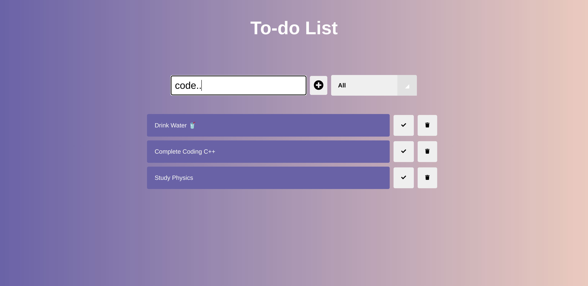

# To-Do List App

A basic yet functional To-Do List application built using **HTML**, **CSS**, and **JavaScript**. This app allows users to add, mark as complete, and delete tasks. It also includes a category filter for task management.

## ✨ Features

- **Add Tasks**: Easily add new tasks to your to-do list.
- **Mark as Complete**: Check off completed tasks.
- **Delete Tasks**: Remove tasks from the list.
- **Filter Tasks**: Filter between all, completed, and active tasks.
- **Responsive Design**: Works well across various screen sizes.

## 🛠️ Technologies Used

- **HTML5**: For structuring the webpage.
- **CSS3**: For styling the user interface.
- **JavaScript (ES6)**: For handling the dynamic behavior of the app.
